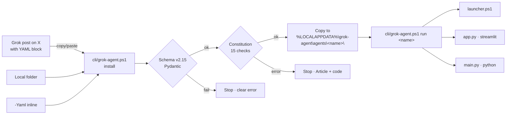

<!-- Copyright 2026 AgentMindCloud -->
<!-- Licensed under the Apache License, Version 2.0 -->
<!-- http://www.apache.org/licenses/LICENSE-2.0 -->

<p align="center">
  
</p>

<p align="center">
  <a href="https://readme-typing-svg.demolab.com">
    
  </a>
</p>

<p align="center">
  
  
  
  
  
  
</p>

<p align="center">
  <b>The Windows-first distribution layer that makes Grok the easiest, most powerful, and most magical platform for deploying agents on X.</b>
</p>

---

## TL;DR

`AgentMindCloud/grok-agent` is the **missing OS layer** for Grok agents on X.

- **One YAML** — `grok-agent.yaml` v2.15 — describes the whole agent (kind, tools, public APIs, multi-agent role, safety, cost limits, HITL gates).
- **One PowerShell command** installs it locally on Windows 11 with no admin rights, no surprises.
- **One Constitution** governs every shipped agent: mandatory disclaimers on finance/tax/real-world tools, machine-checkable consent gates, hard refusals enforced in CI.

> **Built to help xAI and Grok win.** We are ecosystem allies, not competitors. Everything in this repo is Apache 2.0 and designed so any of it can be folded into an official xAI standard whenever they want it. See [`docs/for-xai-adoption.md`](docs/for-xai-adoption.md).

---

## Why this exists

Grok 4.3 is the best agent LLM running on X. The thing that's missing is a **distribution + runtime layer** so creators can author, install, and run agents safely. Today, an X user who wants to install a Grok-powered agent copies code from a thread, installs random Python deps, and hopes. There is no schema, no provenance, no consent gate, no mandatory disclaimers, no path for a non-technical creator to ship one safely.

Grok Agent OS closes that gap. The same way `package.json` made JavaScript ecosystems work — but Windows-native, Constitution-enforced, and X-shaped.

---

## 60-second quick start (Windows)

```powershell
# 1. Clone
git clone https://github.com/AgentMindCloud/grok-agent.git
cd grok-agent

# 2. Install Python deps (per-user, no admin)
python -m pip install --user 'pydantic>=2.7,<3' 'pyyaml>=6.0'

# 3. Allow PowerShell scripts (one-time, no admin)
Set-ExecutionPolicy -Scope CurrentUser -ExecutionPolicy RemoteSigned

# 4. Show the CLI
.\cli\grok-agent.ps1 help

# 5. Validate the canonical schema (sanity check)
.\cli\grok-agent.ps1 validate spec\v2.15\grok-agent.yaml

# 6. Scaffold + install your first agent
.\cli\grok-agent.ps1 new my-first-agent
.\cli\grok-agent.ps1 install my-first-agent
.\cli\grok-agent.ps1 list
.\cli\grok-agent.ps1 run my-first-agent
```

The full Windows walkthrough — execution policy, AppData paths, troubleshooting, the paste-install flow — lives in [`docs/windows-guide.md`](docs/windows-guide.md).

---

## "grok install this" — the X-native install primitive

When a Grok post on X contains a `grok-agent.yaml` block, anyone can install it with one paste:

```powershell
.\cli\grok-agent.ps1 install -FromStdin
# Paste the YAML block, then Ctrl-Z then Enter
```

The CLI:

1. Validates the manifest against v2.15 (Pydantic deep schema check).
2. Runs the Constitution scanner — 15 named checks blocking non-compliant manifests.
3. Copies the agent into `$env:LOCALAPPDATA\grok-agent\agents\<name>\`.

No admin. No signup. No marketplace. Just a YAML in a Grok reply.

---

## What's shipped today

| Layer | Path | What it does |
|---|---|---|
| **Open manifest standard** | [`spec/v2.15/grok-agent.yaml`](spec/v2.15/grok-agent.yaml) | 596-line documented schema, 100% backwards-compat with v2.14, includes 3 canonical examples. |
| **Windows PowerShell CLI** | [`cli/grok-agent.ps1`](cli/grok-agent.ps1) | `help` / `new` / `install` / `validate` / `list` / `run`, plus `-FromStdin` for paste-install. |
| **Pydantic deep validator** | [`cli/grok-agent.py`](cli/grok-agent.py) | v2 strict mode (`extra="forbid"`); typos surface instantly. |
| **Agent Constitution v1.0** | [`safety/constitution.md`](safety/constitution.md) | 9 articles, per-kind specializations, mandatory disclaimer wording. |
| **Constitution scanner** | [`safety/scanner.py`](safety/scanner.py) | 15 named checks; `scan` / `scan-all` / JSON output / severity floors. |
| **CI workflow** | [`.github/workflows/validate.yml`](.github/workflows/validate.yml) | Schema + Constitution scan on every PR; non-compliant manifests block merge. |
| **8 starter manifests** | [`templates/`](templates/) | 2 finance, 2 creator, 2 x-native, 2 general — all pass scanner with zero findings. |
| **Docs** | [`docs/`](docs/) | `index.md`, `windows-guide.md`, `for-xai-adoption.md`. |

Phase 1 is **12 of 18 prompts** complete (P1–P12). Track progress in [`HANDOFF_LOG.md`](HANDOFF_LOG.md).

---

## The 7 Super Agents — Phase 4 vision

Three flagship Super Agents (Recipe C, 8 prompts each) plus four lighter ones (1 manifest each). All built on the same v2.15 standard, sharing memory + provenance + safety patterns.

| # | Super Agent | What makes it magical |
|---|---|---|
| 1 | **Living Narrative Fabric** | Versioned synthesis of X + news + academic + government + personal data with full provenance. Surfaces contradictions across sources instead of silently picking a side. The user can rewind to any prior synthesis state. |
| 2 | **Self-Evolving Personal OS** | Personal OS that learns the user's habits, preferences, and goals; updates itself nightly. Every change is logged and reversible. |
| 3 | **Cross-Reality Action Fabric** | Takes real-world actions across web, calendar, X, and files. Every action is gated by an explicit consent step. Never autonomous. |
| 4 | **Agent Swarm with Shared Memory** | Multi-agent orchestration via `multi_agent.shared_memory: mem0://grok-agent-shared`. |
| 5 | **Provenance-First Trust Engine** | Every claim attaches a citation + source + retrieved-at timestamp. Append-only provenance log. |
| 6 | **Narrative Contradiction Detector** | Flags when two sources disagree on a fact and shows both — refuses to silently pick one. |
| 7 | **Zero-Config "I Want To…" Agent** | Plain-language goal in, action plan out. The plan goes through HITL before any step executes. |

Each ships with a Streamlit dashboard, a Promptfoo + DeepEval + Langfuse improvement loop, and a Demo + X launch thread. See `templates/super-agents/` (folders created in Phase 4).

---

## Architecture (install + run flow)



---

## The 5-phase roadmap

| Phase | Prompt range | Goal | Status |
|---|---|---|---|
| **1** | P1–P18 | Core platform: schema, CLI, scanner, Constitution, CI, 8 starter templates | 12/18 — **in progress** |
| **2** | P19–P42 | X Money tools suite (4 tools × 6 prompts) — companion dashboard, cashtag alpha engine, payout optimizer, vision analyzer | upcoming |
| **3** | P43–P92 | Creator distribution flywheel — 20 templates × 2 prompts + 10 program prompts | upcoming |
| **4** | P93–P124 | 7 Super Agents + Promptfoo/DeepEval/Langfuse self-improvement loop | upcoming |
| **5** | P125+ | Marketplace (Next.js on Vercel) + "Deploy to X" + xAI partnership pitch | upcoming |
| | | **~126 prompts total** | |

The full sequenced plan lives in [`CLAUDE.md`](CLAUDE.md). Each prompt is atomic, testable, and adds one row to [`HANDOFF_LOG.md`](HANDOFF_LOG.md).

---

## Mandatory disclaimers (enforced by CI)

Every shipped agent inherits the [Agent Constitution](safety/constitution.md). Three banner classes are mandatory and **cannot be disabled** via configuration:

> ⚠️ **Not financial advice.** This tool provides information only.
> Always consult a licensed financial advisor before making decisions.

> ⚠️ **Not tax advice.** Tax obligations vary by jurisdiction.
> Consult a licensed tax professional. Especially relevant for Vietnam-resident creators with international platform earnings.

> ⚠️ **This agent can take real-world actions.** Every action requires explicit consent.
> Review the action plan before approving. The agent never acts autonomously.

The CI scanner blocks any finance/tax/real-world-action agent missing the appropriate banner. See `safety/constitution.md` Article V for the per-kind matrix.

---

## Get involved

| Role | Where to start |
|---|---|
| **Author an agent** | Read [`docs/windows-guide.md`](docs/windows-guide.md) sections 5–7, then run `.\cli\grok-agent.ps1 new your-agent`. |
| **Contribute code** | Read [`CONTRIBUTING.md`](CONTRIBUTING.md) — covers commit format, HANDOFF_LOG protocol, and the PR checklist. |
| **Report a bug** | Open a [GitHub issue](https://github.com/AgentMindCloud/grok-agent/issues). |
| **Report a vulnerability** | Read [`SECURITY.md`](SECURITY.md) — use the private GH Security Advisory channel. |
| **Community standards** | Read [`CODE_OF_CONDUCT.md`](CODE_OF_CONDUCT.md) — Contributor Covenant + the project's xAI-ally clause. |
| **For xAI engineers** | Read [`docs/for-xai-adoption.md`](docs/for-xai-adoption.md) — short, honest pitch. |

---

## Stack

| Layer | Choice |
|---|---|
| OS target | Windows 11 + Google Chrome |
| Shell | PowerShell (5.1+ or 7+) |
| Language | Python 3.12 |
| App framework | Streamlit (for X Money tools) |
| Schema validation | Pydantic v2 |
| Local storage | SQLite (DPAPI-encrypted at rest) |
| Super-agent orchestration | Mastra or LangGraph |
| Memory | Mem0 + Qdrant |
| Tracing / eval | Langfuse + Promptfoo + DeepEval |
| LLM | Grok 4.3 (via xAI API) |

---

## License + author

- **License:** Apache 2.0 (see [`LICENSE`](LICENSE)). Every code file carries the standard header. Every shipped agent must declare `license: "Apache-2.0"` in its manifest.
- **Author:** [@JanSol0s](https://x.com/JanSol0s) · `AgentMindCloud`
- **Repo:** `github.com/AgentMindCloud/grok-agent`
- **Schema:** [`spec/v2.15/grok-agent.yaml`](spec/v2.15/grok-agent.yaml)
- **Constitution:** [`safety/constitution.md`](safety/constitution.md)
- **Roadmap:** [`CLAUDE.md`](CLAUDE.md) (~126-prompt sequence across 5 phases)

---

*Note (May 2026): A full audit of the workplan against current repo state is available at [`docs/workplan-audit.md`](docs/workplan-audit.md). It identifies completed items, gaps, and prioritized next steps.*

---

<p align="center">
  <i>We win when xAI and Grok win.</i><br/>
  <b>Built to help xAI and Grok win. 🚀</b>
</p>

<p align="center">
  
</p>
