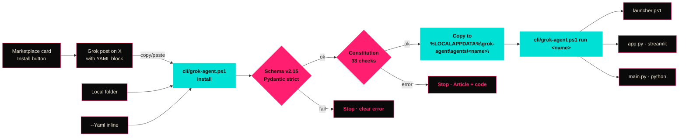

<!-- Copyright 2026 AgentMindCloud -->
<!-- Licensed under the Apache License, Version 2.0 -->
<!-- http://www.apache.org/licenses/LICENSE-2.0 -->

<p align="center">
  
</p>

<p align="center">
  <a href="https://readme-typing-svg.demolab.com">
    
  </a>
</p>

<p align="center">
  
  
  
  
  
  
  
</p>

<p align="center">
  <b>The Windows-first distribution layer for deploying Grok agents on X — one YAML, one PowerShell command, one safety scanner.</b>
</p>

<p align="center">
  <i>Built for xAI, X, Grok and the ecosystem community. ❤️</i>
</p>

<p align="center">
  <a href="marketplace/index.html"><b>🛒 Marketplace (GitHub Pages)</b></a>
  &nbsp;·&nbsp;
  <a href="marketplace/"><b>Next.js dynamic marketplace</b></a>
  &nbsp;·&nbsp;
  <a href="docs/"><b>Docs</b></a>
  &nbsp;·&nbsp;
  <a href="CONTRIBUTING.md"><b>Contribute</b></a>
</p>

<p align="center">
  <i>The static <code>marketplace/index.html</code> is a zero-build, GitHub-Pages-ready landing page that lists the 7 Super Agents and the 22 Creator Templates teaser. Open it in a browser, or serve it with <code>python -m http.server</code>.</i>
</p>

<p align="center">
  
</p>

---

## TL;DR

`AgentMindCloud/grok-agent` is the **missing OS layer** for Grok agents on X.

- **One YAML** — `grok-agent.yaml` v2.15 — describes the whole agent (kind, tools, public APIs, multi-agent role, safety, cost limits, HITL gates).
- **One PowerShell command** installs it locally on Windows 11 with no admin rights, no surprises.
- **One Agent Constitution** governs every shipped agent: mandatory disclaimers on finance/tax/real-world tools, machine-checkable consent gates, hard refusals enforced in CI.

**11 production agents** ship today — 4 X Money tools, 3 flagship Super Agents, 4 lighter Super Agents — all discoverable through the dynamic Next.js [marketplace](marketplace/).

---

<p align="center">
  
  &nbsp;
  
</p>

## What's shipped (May 2026)

| Phase | Range | What landed | Status |
|---|---|---|---|
| **1** | P1–P18 | Core platform — v2.15 schema, PowerShell + Python CLIs, safety scanner (33 checks), Agent Constitution, CI workflow, 8 starter manifests | ✅ done |
| **2** | P19–P42 | **4 X Money tools** — Companion Dashboard, Smart Cashtag Alpha Engine, Creator Payout Optimizer, Vision Analyzer (Recipe A × 6 prompts each) | ✅ done |
| **3** | P43–P92 | **22 creator templates** + outreach program — content, replies, analytics, monetization, threads, mentions, DMs, growth, hashtags, content calendars, A/B testing, recycling, brand voice | ✅ done |
| **4** | P93–P124 | **7 Super Agents** — 3 flagship (Recipe C × 8 prompts) + 4 lighter (manifest + README), self-improvement infra | ✅ done |
| **5** | P125+ | Marketplace (Next.js on Vercel) + "Deploy to X" + xAI partnership pitch + 60-second demo | 🚧 active |

Track every prompt in [`HANDOFF_LOG.md`](HANDOFF_LOG.md). The latest gap analysis lives in [`docs/workplan-audit.md`](docs/workplan-audit.md).

---

<p align="center">
  
</p>

## The 11 agents

> ◆ **Tools tab** of the consumer cathedral. Each agent ships with a v2.15 manifest, Apache 2.0 license, and Constitution-enforced disclaimers.

### 4 X Money tools — `templates/finance/`

| ◆ | Agent | What it does | Cost cap |
|---|---|---|---|
| 1 | [`x-money-companion-dashboard`](templates/finance/x-money-companion-dashboard/) | Personal X Money command centre — 6 tabs (Overview, Transactions, Analytics, Grok Insights, Tax Export, Alerts), local SQLite. | $0.50 |
| 2 | [`x-smart-cashtag-alpha-engine`](templates/finance/x-smart-cashtag-alpha-engine/) | Real-time cashtag intelligence on X — narrative momentum, contradictions, Grok-powered alpha signals with provenance. | $1.00 |
| 3 | [`x-creator-payout-optimizer`](templates/finance/x-creator-payout-optimizer/) | Earnings forecasting, content optimisation, tax estimator. Cross-tool reads from Tools #1 + #4. | $1.00 |
| 4 | [`x-money-vision-analyzer`](templates/finance/x-money-vision-analyzer/) | Drag-and-drop receipt + statement vision. One-click import into Tool #1's SQLite. | $1.00 |

### 3 flagship Super Agents — `templates/super-agents/`

| ◆ | Agent | Recipe C slots | Cost cap |
|---|---|---|---|
| 1 | [`living-narrative-fabric`](templates/super-agents/living-narrative-fabric/) | Versioned, provenance-first synthesis across X + news + academia + government + open web. Refuses to silently resolve contradictions. | $2.00 |
| 2 | [`self-evolving-personal-os`](templates/super-agents/self-evolving-personal-os/) | Personal second brain — morning briefings, long-term memory, auto-evolving workflows, full rewind, explicit-consent gates. | $1.50 |
| 3 | [`cross-reality-action-fabric`](templates/super-agents/cross-reality-action-fabric/) | Bridge agent between X / Grok and the user's Windows machine + open web. Every action gated, reversible, provenance-logged. | $0.50 |

### 4 lighter Super Agents — `templates/super-agents/`

| ◆ | Agent | What makes it useful |
|---|---|---|
| 4 | [`agent-swarm-with-shared-memory`](templates/super-agents/agent-swarm-with-shared-memory/) | 6-agent swarm (researcher, skeptic, creator, executor, archivist, orchestrator) sharing Mem0 + Qdrant memory. |
| 5 | [`provenance-first-trust-engine`](templates/super-agents/provenance-first-trust-engine/) | Every claim attaches a citation + confidence score; clickable provenance report on every response. |
| 6 | [`narrative-contradiction-detector`](templates/super-agents/narrative-contradiction-detector/) | Surfaces conflicts across X, news, gov, academic, and personal sources with primary links + equal rigour. |
| 7 | [`zero-config-i-want-to-agent`](templates/super-agents/zero-config-i-want-to-agent/) | Plain-language goal in, action plan out — every external action HITL-gated. |

---

## 60-second quick start (Windows 11, PowerShell)

```powershell
# 1. Clone
git clone https://github.com/AgentMindCloud/grok-agent.git
cd grok-agent

# 2. Install Python deps (per-user, no admin)
python -m pip install --user 'pydantic>=2.7,<3' 'pyyaml>=6.0'

# 3. Allow PowerShell scripts (one-time, no admin)
Set-ExecutionPolicy -Scope CurrentUser -ExecutionPolicy RemoteSigned

# 4. Show the CLI
.\cli\grok-agent.ps1 help

# 5. Validate a shipped manifest
.\cli\grok-agent.ps1 validate templates\super-agents\living-narrative-fabric\grok-agent.yaml

# 6. Scaffold + install your own agent
python scripts\generate-template.py new my-first-agent `
    --kind super-agent `
    --description "Quickstart agent for the README walkthrough." `
    --out templates\super-agents\my-first-agent
.\cli\grok-agent.ps1 install templates\super-agents\my-first-agent\grok-agent.yaml
.\cli\grok-agent.ps1 list
.\cli\grok-agent.ps1 run my-first-agent
```

The full Windows walkthrough — execution policy, AppData paths, troubleshooting, the paste-install flow — lives in [`docs/windows-guide.md`](docs/windows-guide.md).

---

## "grok install this" — the X-native install primitive

When a Grok post on X contains a `grok-agent.yaml` block, anyone can install it with one paste:

```powershell
.\cli\grok-agent.ps1 install -FromStdin
# Paste the YAML block, then Ctrl-Z then Enter
```

The CLI:

1. Validates the manifest against v2.15 (Pydantic deep schema check).
2. Runs the Constitution scanner — **33 named checks** blocking non-compliant manifests.
3. Copies the agent into `$env:LOCALAPPDATA\grok-agent\agents\<name>\`.

No admin. No signup. No required marketplace. Just a YAML in a Grok reply.

---

## Marketplace (Phase 5 — live)

> ⚠️ **Manual step required:** Settings → Pages → Source → **GitHub Actions** (then re-run workflow before this Action will publish).

The [marketplace](marketplace/) is a Next.js 14 + TypeScript app that **discovers every shipped manifest at build time** — no hand-maintained list. Drop a new `grok-agent.yaml` under `templates/super-agents/` or `templates/finance/`, run `npm run build`, and your agent appears in the grid.

```powershell
cd marketplace
npm install
npm run dev
Start-Process "http://localhost:3030"
```

Each card includes a one-click "Install — copy 'grok install this'" button (writes the install one-liner straight to the clipboard) and a link to the manifest on GitHub. Category filters between *Super Agents* and *X Money Tools*. Vercel-ready (`next.config.js` already sets `output: 'standalone'`).

---

## Architecture (install + run flow)



---

## Stack

| Layer | Choice |
|---|---|
| OS target | Windows 11 + Google Chrome |
| Shell | PowerShell (5.1+ or 7+) |
| Language | Python 3.12 |
| App framework | Streamlit (X Money tools, Super Agent dashboards) |
| Schema validation | Pydantic v2 (strict mode) |
| Local storage | SQLite (DPAPI-encrypted at rest) |
| Super-agent orchestration | Mastra or LangGraph |
| Memory | Mem0 + Qdrant |
| Tracing / eval | Langfuse + Promptfoo + DeepEval |
| Marketplace | Next.js 14 + TypeScript + js-yaml on Vercel |
| LLM | Grok 4.3 (via xAI API) |
| Type system | Inter (headings) + JetBrains Mono (code, terminal, typing-SVG) |
| Visual identity | Spectral v1 — Plasma `#FF1E70` · Aurora `#00E0D5` · Dark `#0A0A0A` |

---

## Mandatory disclaimers (enforced by CI)

Every shipped agent inherits the [Agent Constitution](safety/constitution.md). Three banner classes are mandatory and **cannot be disabled** via configuration:

> ⚠️ **Not financial advice.** This tool provides information only.
> Always consult a licensed financial advisor before making decisions.

> ⚠️ **Not tax advice.** Tax obligations vary by jurisdiction.
> Consult a licensed tax professional.

> ⚠️ **This agent can take real-world actions.** Every action requires explicit consent.
> Review the action plan before approving. The agent never acts autonomously.

The CI scanner blocks any finance / tax / real-world-action agent missing the appropriate banner. See `safety/constitution.md` Article V for the per-kind matrix.

---

## Get involved

| Role | Where to start |
|---|---|
| **Author an agent** | Read [`docs/windows-guide.md`](docs/windows-guide.md) sections 5–7, then run `python scripts\generate-template.py new <slug> --kind <kind> --description "..." --out templates\<folder>\<slug>`. |
| **Browse + install** | Open the [marketplace](marketplace/) (`cd marketplace && npm run dev`). Click "Install" on any card to copy the one-liner. |
| **Contribute code** | Read [`CONTRIBUTING.md`](CONTRIBUTING.md) — covers commit format, HANDOFF_LOG protocol, PR checklist. |
| **Report a bug** | Open a [GitHub issue](https://github.com/AgentMindCloud/grok-agent/issues). |
| **Report a vulnerability** | Read [`SECURITY.md`](SECURITY.md) — private GitHub Security Advisory. |
| **For xAI engineers** | Read [`docs/for-xai-adoption.md`](docs/for-xai-adoption.md) — short, honest pitch + the [`docs/pitch/xai-partnership-pitch.md`](docs/pitch/xai-partnership-pitch.md) RFC. |

---

## Demo videos

90-second walk-throughs for the three flagship Super Agents. The
storyboards (B-roll, captions, voice-over beats, plus 30-second and
15-second recuts) live next to each agent's manifest:

| Super Agent | Storyboard | Video (planned) |
|---|---|---|
| Living Narrative Fabric | [`DEMO.md`](templates/super-agents/living-narrative-fabric/DEMO.md) | [GitHub Releases](https://github.com/AgentMindCloud/grok-agent/releases/tag/demo-living-narrative-fabric) (upload pending) |
| Self-Evolving Personal OS | [`DEMO.md`](templates/super-agents/self-evolving-personal-os/DEMO.md) | [GitHub Releases](https://github.com/AgentMindCloud/grok-agent/releases/tag/demo-self-evolving-personal-os) (upload pending) |
| Cross-Reality Action Fabric | [`DEMO.md`](templates/super-agents/cross-reality-action-fabric/DEMO.md) | [GitHub Releases](https://github.com/AgentMindCloud/grok-agent/releases/tag/demo-cross-reality-action-fabric) (upload pending) |

The X launch threads ship with each video and live alongside the
storyboards as `X_LAUNCH_THREAD.md`.

---

## License + author

- **License:** Apache 2.0 (see [`LICENSE`](LICENSE)). Every code file carries the standard header. Every shipped agent must declare `license: "Apache-2.0"` in its manifest.
- **Author:** [@JanSol0s](https://x.com/JanSol0s) · `AgentMindCloud`
- **Repo:** `github.com/AgentMindCloud/grok-agent`
- **Schema:** [`spec/v2.15/grok-agent.yaml`](spec/v2.15/grok-agent.yaml) · [changelog](spec/v2.15/changelog.md) · [windows extensions](spec/v2.15/windows-extensions.yaml)
- **Constitution:** [`safety/constitution.md`](safety/constitution.md) (33 checks in `safety/scanner.py`)
- **Roadmap:** [`ROADMAP.md`](ROADMAP.md) · full plan in [`CLAUDE.md`](CLAUDE.md)
- **Audit:** [`docs/workplan-audit.md`](docs/workplan-audit.md) — what's shipped + what's left.

---

<p align="center">
  <i>Built for xAI, X, Grok and the ecosystem community. ❤️</i>
</p>

<p align="center">
  
</p>
